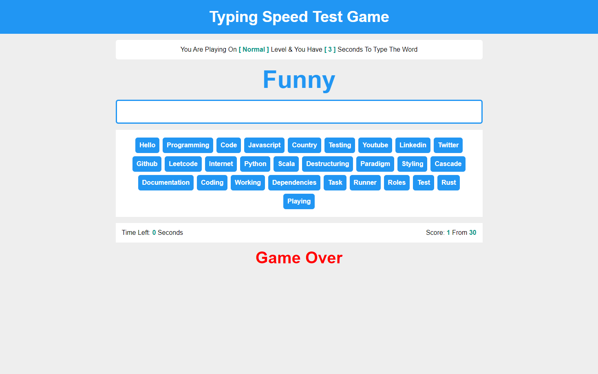

# Typing Speed Test Game
## Overview:
Test and improve your typing speed with the Typing Speed Test Game. This interactive game challenges players to type a given set of words or sentences accurately and quickly.

## Levels:

- **Easy**: A beginner-friendly level with simple words and short sentences.
- **Normal**: A moderate level with a mix of words and longer sentences.
- **Hard**: A challenging level with complex words and extended sentences.

## How to Play:

- Open index.html in your web browser.
- Select a difficulty level: Easy, Normal, or Hard.
- Start typing the displayed text as quickly and accurately as possible.

## Features:

- Varied difficulty levels to accommodate different skill levels.
- Engaging and interactive interface for an enjoyable learning experience.

Challenge yourself and enhance your typing skills across different difficulty levels with the Typing Speed Test Game! ⌨️🚀

